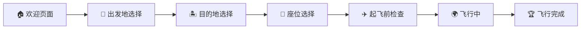
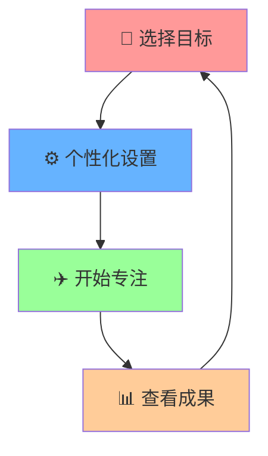

<div align="center">

# ✈️ Focus on Aircraft

### 🎯 让专注变得有趣的飞行主题应用

<p align="center">
  
  
  
  
</p>

**一个以飞行为主题的专注力训练应用，通过模拟真实飞行体验帮助用户保持专注状态，让工作和学习变得更加有趣！**

</div>

---

## 📋 目录

- [🎯 项目特色](#-项目特色)
- [🚀 功能模块](#-功能模块)
- [🛠️ 技术栈](#️-技术栈)
- [💻 系统要求](#-系统要求)
- [🗺️ 高德地图API配置](#️-高德地图api配置)
- [🚀 快速开始](#-快速开始)
- [📱 使用说明](#-使用说明)
- [🎨 设计理念](#-设计理念)
- [🚀 部署指南](#-部署指南)

---

## 🎯 项目特色

<table>
<tr>
<td width="50%">

### 🌟 核心特色
- ✈️ **沉浸式飞行体验**: 通过飞行主题让专注变得有趣
- 🎮 **完整流程设计**: 从起飞准备到降落的完整体验
- ⚙️ **个性化设置**: 自定义目的地、座位偏好和专注任务

</td>
<td width="50%">

### 📊 智能功能
- 📍 **实时飞行追踪**: 可视化飞行进度和专注时长
- 🏆 **成就系统**: 根据专注表现获得不同成就
- 📈 **数据分析**: 专注时长统计和趋势分析

</td>
</tr>
</table>

---

## 🚀 功能模块

<div align="center">



</div>

| 步骤 | 模块 | 功能描述 | 特色功能 |
|:---:|:---:|:---|:---|
| 1 | 🏠 **欢迎页面** | 应用介绍与新手引导 | 🎬 动画介绍、📋 功能概览 |
| 2 | 🛫 **出发地选择** | 目标:选择全球机场作为起点 | 🌍 目标:全球机场数据、🔍 智能搜索 |
| 3 | 🏝️ **目的地选择** | 目标:智能推荐热门目的地 | 🎯 目标:个性化推荐、📊 目标:热度排行 |
| 4 | 💺 **座位选择** | 自定义座位偏好设置 | ✈️ 座位图、🎨 个性化配置 |
| 5 | ✈️ **起飞前检查** | 完整的准备状态检查清单 | ☑️ 交互式清单、⚡ 状态验证 |
| 6 | 🌍 **飞行中** | 实时飞行仪表盘和任务提醒 | 📊 实时数据、🔔 智能提醒 |
| 7 | 🏆 **飞行完成** | 飞行统计与成就展示 | 📈 数据分析、🏅 成就系统 |

---

## 🛠️ 技术栈

<div align="center">

### 🎨 前端技术

<table>
<tr>
<td align="center" width="20%">
<br>
<strong>HTML5</strong><br>
<sub>语义化结构</sub>
</td>
<td align="center" width="20%">
<br>
<strong>CSS3</strong><br>
<sub>现代样式设计</sub>
</td>
<td align="center" width="20%">
<br>
<strong>ES6+</strong><br>
<sub>模块化开发</sub>
</td>
<td align="center" width="20%">
<br>
<strong>高德地图API</strong><br>
<sub>地理位置服务</sub>
</td>
<td align="center" width="20%">
<br>
<strong>Leaflet.js</strong><br>
<sub>交互式地图</sub>
</td>
</tr>
</table>

### 🔧 后端技术

<table>
<tr>
<td align="center" width="33%">
<br>
<strong>Node.js</strong><br>
<sub>服务器运行环境</sub>
</td>
<td align="center" width="33%">
<br>
<strong>Express.js</strong><br>
<sub>Web应用框架</sub>
</td>
<td align="center" width="33%">
<br>
<strong>CORS</strong><br>
<sub>跨域资源共享</sub>
</td>
</tr>
</table>

### 📱 其他特性

| 特性 | 说明 | 技术实现 |
|:---:|:---|:---|
| 📱 **响应式设计** | 支持多设备适配 | CSS Grid + Flexbox |
| 🎨 **图标库** | 丰富的视觉元素 | Font Awesome 6.4.0 |
| 💾 **数据存储** | 本地数据持久化 | LocalStorage + SessionStorage |
| 🔔 **推送通知** | 智能提醒系统 | Web Notifications API |

</div>

---

## 💻 系统要求

<div align="center">

| 组件 | 最低版本 | 推荐版本 | 说明 |
|:---:|:---:|:---:|:---|
| 🖥️ **操作系统** | - | - | Windows 10+, macOS 10.15+, Linux (Ubuntu 18.04+) |
| 🟢 **Node.js** | 16.0+ | 18.0+ | JavaScript 运行时环境 |
| 📦 **npm** | 8.0+ | 9.0+ | 包管理工具 |
| 🌐 **浏览器** | Chrome 90+ | Chrome 最新版 | 现代浏览器支持 |

</div>

---

## 🗺️ 高德地图API配置

<div align="center">

### 🔑 快速配置指南

</div>

<table>
<tr>
<td width="50%">

#### 📝 **获取API密钥**

1. **注册账号**
   - 访问 [高德开放平台](https://lbs.amap.com/)
   - 注册开发者账号

2. **创建应用**
   - 进入控制台创建新应用
   - 选择"Web端(JS API)"

3. **获取Key**
   - 复制生成的API Key
   - 配置服务平台为"Web端(JS API)"

</td>
<td width="50%">

#### ⚙️ **项目配置**

**方法：环境变量 (推荐)**
```javascript
// server.js
const TENCENT_MAP_CONFIG = {
    key: '',  //腾讯地图API密钥
    secretKey: '' //腾讯地图安全密钥
};
```
</td>
</tr>
</table>

---

## 🚀 快速开始

<div align="center">

### ⚡ 三步启动项目

</div>

<table>
<tr>
<td width="33%" align="center">

#### 1️⃣ 克隆项目
```bash
git clone [项目地址]
cd Focus_on_Aircraft
```
📥 **下载源代码**

</td>
<td width="33%" align="center">

#### 2️⃣ 安装依赖
```bash
npm install
```
📦 **安装所需包**

</td>
<td width="33%" align="center">

#### 3️⃣ 启动服务
```bash
npm start
```
🚀 **运行应用**

</td>
</tr>
</table>

<div align="center">

### 🌐 访问应用

**本地开发**: [http://localhost:3000](http://localhost:8080)

**移动端**: 使用相同地址在移动设备上访问

</div>

---

## 📱 使用说明

<div align="center">

### 🎯 三步专注法

</div>



| 步骤 | 操作说明 | 预计时间 |
|:---:|:---|:---:|
| 🎯 **设定目标** | 选择出发地和目的地机场 | 2-3 分钟 |
| ⚙️ **个性化配置** | 座位选择、专注任务设定 | 1-2 分钟 |
| ✈️ **专注飞行** | 沉浸式专注体验 | 25-120 分钟 |
| 📊 **回顾总结** | 查看专注成果和统计数据 | 1-2 分钟 |

---

## 🎨 设计理念

<div align="center">

### 💡 核心设计原则

</div>

<table>
<tr>
<td width="33%" align="center">

### 🎭 沉浸式体验
**飞行主题增强专注氛围**
- 🎵 环境音效
- 🎨 视觉设计
- 🎮 交互体验

</td>
<td width="33%" align="center">

### 📈 渐进式引导
**分步骤帮助用户完成设置**
- 👆 简单操作
- 📋 清晰指引
- 🎯 目标明确

</td>
<td width="33%" align="center">

### 📊 视觉反馈
**实时显示进度和状态**
- ⏱️ 时间追踪
- 📍 位置显示
- 🏆 成就系统

</td>
</tr>
</table>

---

## 🚀 部署指南

<div align="center">

### 🌐 生产环境部署

</div>

#### 📋 部署选项

| 方式 | 难度 | 适用场景 | 推荐指数 |
|:---:|:---:|:---|:---:|
| 🖥️ **传统服务器** | ⭐⭐⭐ | VPS/云服务器 | ⭐⭐⭐⭐⭐ |
| ☁️ **Serverless** | ⭐⭐ | 云函数部署 | ⭐⭐⭐ |

#### 🖥️ 传统服务器部署

```bash
# 1. 安装 PM2
npm install -g pm2

# 2. 启动应用
pm2 start server.js --name "focus-aircraft"

# 3. 配置 Nginx 代理
sudo nano /etc/nginx/sites-available/focus-aircraft
```

**Nginx 配置示例**:
```nginx
server {
    listen 80;
    server_name your-domain.com;
    
    location / {
        proxy_pass http://localhost:3000;
        proxy_set_header Host $host;
        proxy_set_header X-Real-IP $remote_addr;
    }
}
```

---

<div align="center">

## 📄 许可证

本项目采用 **CC BY-NC 4.0** 许可证 - 查看 [LICENSE](LICENSE) 文件了解详情

**🎓 教育友好许可证**: 
- ✅ **自由使用**: 教育、研究、个人用途完全免费  
- 🏷️ **署名要求**: 使用时需标注原作者信息  
- 🚫 **非商业**: 禁止商业用途，保持项目教育本质  
- 🔄 **允许修改**: 可以自由修改和分发衍生作品

---

**⭐ 如果这个项目对你有帮助，请给个Star支持一下！**

**🚀 让专注变得有趣，让时间更有价值！**

</div>